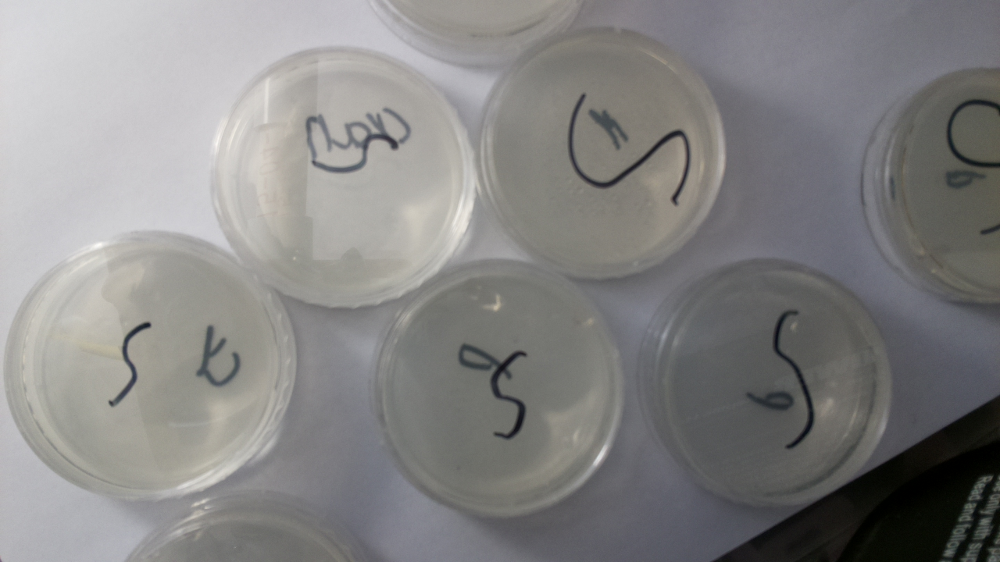
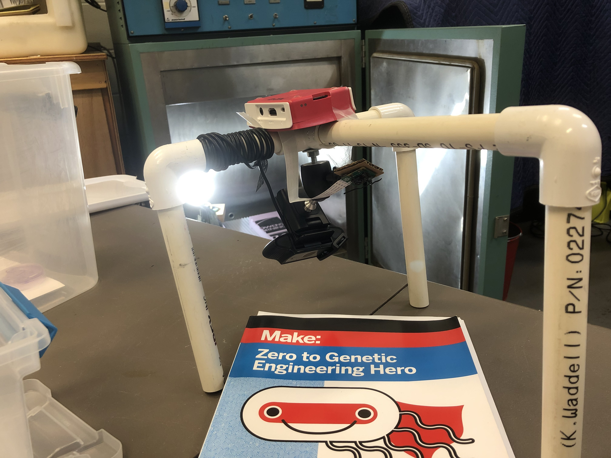

# pilapse
Simple timelapse recorder written in python for Raspberry Pi.

**Note: this has only been tested with python3 on Raspberry Pi OS Bullseye, please use these versions.**

## Setup

There really isn't all that much to setup, just make sure to install screen (or your preferred terminal multiplexer) using `sudo apt-get update && sudo apt-get install screen`.

Make sure you have python3 by running `python3 --version`, if you don't get the version, run `sudo apt-get install python3`.

Download sripts to a known location, e.g. `/home/pi`.

All following instructions are to be run on the Raspbery Pi.

## How to Use

If you haven't already, run `screen -S pilapse`.

`cd` into the directory with the script in it, and run `python3 pilapse.py --help`, and use the help page to help set the required arguments.

Once it is running, you can detach from the screen by pressing `ctrl+a`, and then `d`. To reattach, run `screen -r pilapse`.

If you run it with `--eternal` or `-e`, then you will have to stop it using ctrl+c, and run `ffmpeg -framerate 10 -i images/%08d.jpg output.mp4`, making sure to set the framerate, image folder, and output file to the required values.

## How to Stream

Run `screen -S stream`

Find the start_stream.sh file and run `./start_stream.sh your_youtube_streamkey`. If you get a 'permission denied' error, run `chmod +x start_stream.sh`.

If streaming doesn't start correctly, edit `start_stream.sh` so that `/dev/video1` is changed to your actual camera.

If video is upside down, use `start_stream_vFlip.sh` instead.

Press `ctrl+a` followed by `d` to detach.

### If you aren't satisfied with the focus/exposure

`v4l2-ctl -d 1 -c focus_auto=0` to disable autofocus, and `v4l2-ctl -d 1 -c focus_absolute=focus_you_want` to set the focus to what you want.
`v4l2-ctl -d 1 -c exposure_auto=1` to disable automatic exposure, and `v4l2-ctl -d 1 -c exposure_absolute=exposure_you_want` to set exposure.
`v4l2-ctl -d 1 --all` for more options.
